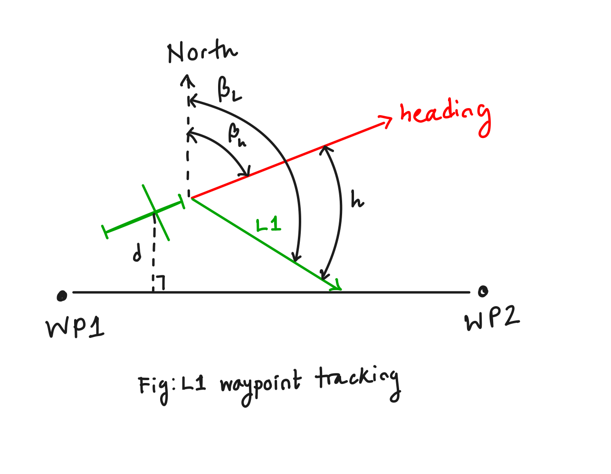
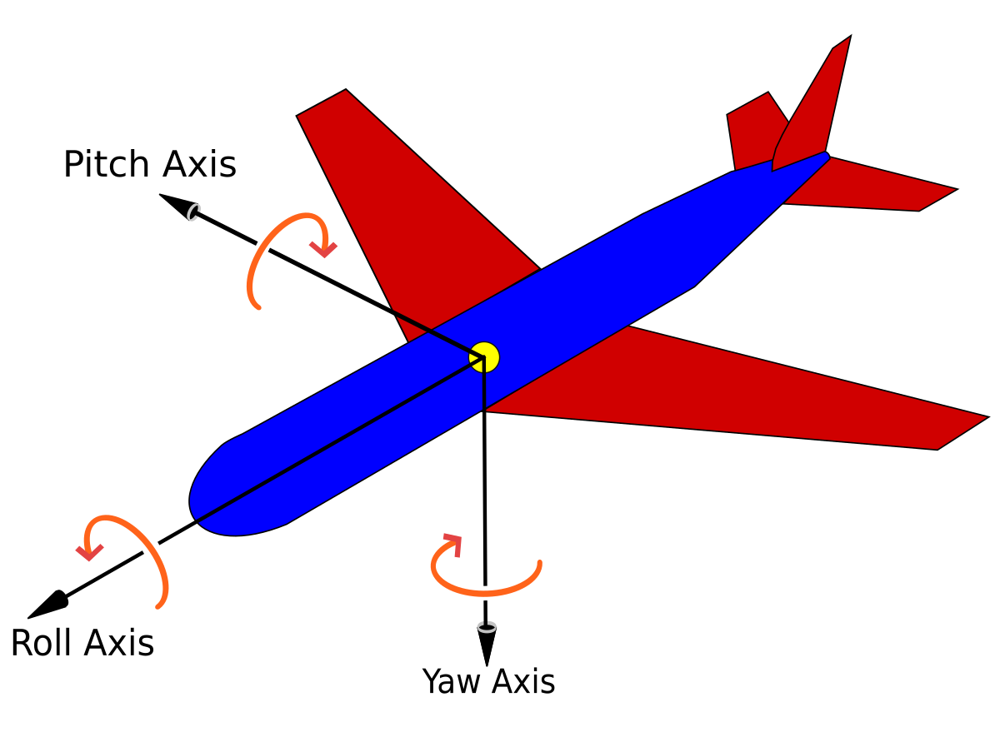

# Basics of UAV flight planning 

The goal of this file is to introduce the bare minimum of a UAV flight that helps us create an adversary class. 

- For a smart adversary, it is instrumental to measure the GPS deviation required to trigger desired course correction. 
    - Naturally, there is a component of time variance associated to the spoofing plan. That is, a smart adversary must have a (finite) time period assigned to the duration of the spoofing attack. The UAV must reach the target destination, set by the spoofer, within the fixed duration. 
    - 

## Course correction

In order to navigate a flight course autonomously, the UAV follows a sequence of waypoints, tracking the flight path from the origin to the target. I demonstrate the process in which the UAV tracks waypoints and reacts to drift. 

- UAV course or heading $H$: The direction of the velocity vector. 
- Lookahead distance, $L_1$: A tunable parameter, $L_1$ determines how far ahead the target location would be for the UAV along the path defined by waypoints. The larger $L_1$ is, the further away target point would be, which usually yield a more consistent flight direction for the UAV. If $L_1$ is too small, the UAV would need to adjust its heading frequently. If $L_1$ is too high, the UAV might not converge to the path line fast enough.
- To fulfill the required lateral acceleration, the UAV rolls towards the direction of the flight path. The lateral acceleration is given by 
$$a_{lat} = 2\frac{\bf ||v||^2}{L_1} \sin(h)$$

where $\bf v$ is the velocity vector, $L_1$ is the tunable lookahead distance, $h$ is the angle between the heading (direction of the velocity vector) and the vector $\bf L_1$

- The roll angle required to accomplish the lateral movement is given by 
$$\phi = \tan^{-1}(\frac{a_{lat}}{g})$$

So it's clear that the goal of the adversary is to induce slow lateral translation by manipulating the position vector.

