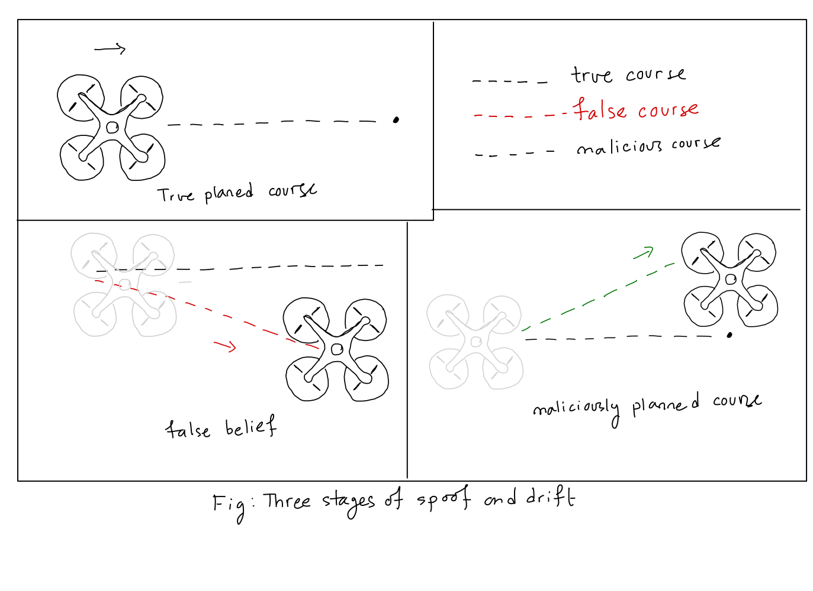

# Aerial Data Analysis

The purpose of the repo is to generate hybrid datasets that can be used to simulate GPS spoofing. We have already attempted to do this once in the `ZurichUrbanMAVData` folder with 'Zurich Urban MAV Dataset'. You can find elaborate description of my findings on `readmefirst` there. 

## Goal

The goal is to see the effect on pose following the introduction of corrupted GPS data. Advanced spoofing techniques like spoof and drift is meant to give the autopilot false impressions of drift. The autopilot then makes corrections to remain on course. This results in false correction and instills false beliefs: autopilot thinks it's on course, in reality the drone drifts off course. We have the following steps ahead of us: 

- Create a dataset from Kalman filter (w/o air drag) fusing (true) GPS, Accelerometer, Gyro, Barometer, Magnetometer (IMU) together: call it `true_course`
- Corrupt GPS Data to simulate spoofing in a dataset, call it `spoofed_gps`
- Fuse `spoofed_gps` and IMU together using the same Kalman filter, call it: `false_course`
- Compare the (x,y) coordinates of `true_course` and `false_course`. 

## What is the current status of work?

Given the limitations of working with Zurich Urban MAV Dataset, I have moved on to using [Canadian Longterm Outdoor UAV Dataset (CLOUD)](https://www.dynsyslab.org/cloud-dataset/). 

- As of Tuesday/23 Afternoon, I have created an extended Kalman filter, and fused the IMU and GPS from the CLOUD dataset. In the analysis [notebook](https://github.com/Sajidbm/Aerial-Data-Analysis/blob/main/CLOUDData/cloud_utias_winter_trial1_teach_analysis.ipynb) I have described the reason I had chosen the winter UTIAS trial 1 dataset. Before I go on to describe my learning from the implementation and possible consequences for future analysis, I want to briefly discuss the plan forward. 
    - To simulate spoof and drift attack on a UAV, we must create three scenarios. 
        - First, we need a *true flight course*: `Pure INS + Pure (unspoofed) GPS`
            - In the deployment, this will be a pre-flight input to the UAV. The UAV's autopilot, guided by GPS (and other navigation systems), uses flight control to follow this path to target.
            - In testing stage, given a dataset, we must generate the true flight course ourselves. This is because, in most cases, we are only given a dataset and are not provided the filtering algorithm used to fuse the onboard sensors. We accomplish this by creating our own filtering algorithm `Custom`, and performing fusion of onboard sensor data ourselves. 
                - To create a robust flight path during testing, we must be given (1) raw (**bias calibrated**) acceleration + gyroscope + magnetometer data for the entire duration of the flight, (2) GPS position coordinates in GCS coordinate system, (3) GPS velocity estimates, (4) noise covariance estimates for the acceleration + gyroscope + magnetometer, (5) Horizontal dilution of precision (HDOP) and Vertical dilution of precision (VDOP) of GPS, and (6) noise covariance estimates for GPS velocity estimates. 
                - While the error estimates can be derived using inferential or statistical techniques, there's no alternative to (1), (2), (3), and (4). 
                - In the case of CLOUD, we were given (1) `attitude` estimates in quaternion coordinates, (2) raw `IMU` (accelerometer+gyroscope), (3) `gps` coordinates in GCS, and (4) onboard velocity estimates from flight control. Note that even though we were not given magnetometer data, having the attitude estimates from the flight controller fulfilled our requirement for absolute reference for gyroscope. 
        - Second, we need a *false course*: `Pure INS + Spoofed GPS`
            - In deployment, this requirement will be fulfilled by the real time (fused) pose estimates (position, velocity, attitude) of the UAV undergoing suspected spoofing attack. 
            - In testing stage, given a dataset, we will use `Custom` to perform fusion of IMU (accelerometer+gyroscope+magnetometer) and **spoofed** GPS estimates. 
                - It's still not decided if we use the same GPS precision estimates as before, or change the estimates to reflect spoofing. In the ideal scenario, GPS precision estimates are real-time, and vary depending on the terrain, atmospheric noise and availability of satellites. 
            - This stage is to simulate the belief function of the UAV: reflects what the UAV believes to be true. A successful spoof and drift attack instills false belief in the UAV's system, such as drifting/losing altitude. The resulting *false course* is evidence that the UAV's navigation system has been deceived. 
        - Third, we need a (maliciously) *planned course*: `Spoofed GPS + corrected INS`
            - To remain on `true_course` saved within UAV system, the autopilot is expected to make real-time pose corrections. These corrections are guided by the global reference provided by the GPS. In a spoof and drift attack, the adversary tries to skew the pose corrections, giving the autopilot a false impression of drift. Once deceived, we call the skewed path `false_course`. 
            - Guided by false beliefs, the autopilot now makes *unverified* pose corrections through `corrected_INS`, leading to `malicious_course`.
            - In testing stage, we accomplish this by adjusting `attitude` of the dataset.

### Learning

- I realized that accelerations had to be used as control input. This was crucial. We used the attitude measurements to transform the acceleration measurements from the IMU. In that sense, attitude was also a control input, even though we assumed that the attitude was in-built and as a result, we took no step to account of the non-linearity introduced by the transformation by the rotation matrix. We also did not take the precision of the attitude into account for the sake of simplicity. 
- I avoided coming across non-linearity whenever possible. For the GPS measurement model, I assumed that GPS was reported in the ENU ground system. As a result, I did not have to use the Jacobian of the measurement function. 
- Earlier in the analysis, I reported standard deviations in the covariance matrices (instead of variance). This lead to inaccurate route planning.
