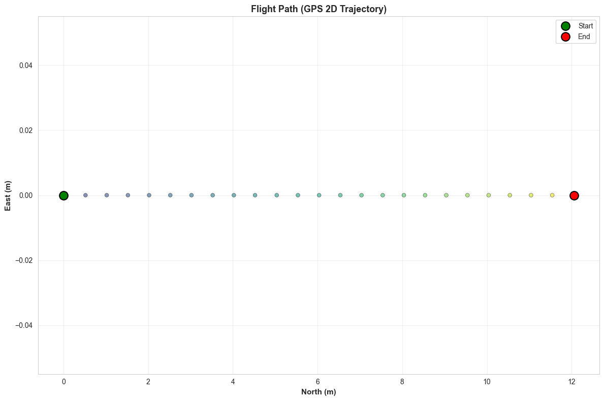

# Experimental results of spoofing in option a: ground validation

## Summary

The ground validation experiment was to check if: 
- (1) we are able to establish successful connection between SITL and MAVLink GPS,
- (2) we are able to update parameters in the SITL, 
- (3) we are able to switch the SITL GPS with MAVLink GPS,
- (4) we are able to send GPS messege packages with gradually drifting coordinates.

We succeeded in each and every task.

## Past vs Present Experiments

- In the **past**, we have tried to directly replace the primary GPS on Ardupilot SITL by setting `GPS1_TYPE = 14`. 
- We did not include any choice of secondary GPS.
- Causing the SITL to raise pre-arm failure error. 
- In our **present** experiment, we are using a dual GPS setup. 
- We keep `GPS1_TYPE = 14` (SITL's GPS) and set `GPS2_TYPE = 14` (MAVLink) which we can control.
- Then we switch `GPS_PRIMARY = 1` to the MAVLink GPS. 
- This solves the pre-arm failure issue.


## Discussion

This experiment is part of an array of experiments we will perform to simulate UAV spoofing under slow drift. On this first experiment of the series, we laid the ground work for spoofing the GPS of a **stationary**, fixed-wing, SITL vehicle using the MAVLink GPS. We witnessed a few interesting phenomenons during our experiment. 

### Drift was reported on the GPS log file

```Python
gps_df = pd.read_csv('last_flight_gps.csv')
gps2_df = gps_df[(gps_df['I'] == 1) & (gps_df['Status'] == 3)] # shows observations of the spoofed UAV 
# I column indicate the GPS instance and Status column indicates the GPS fix type. I = 1 indicates that the UAV is hooked to the MAVLink GPS and Status = 3 indicates that the GPS has a 3D fix. 
```

The spoofing continued for a total of 25 seconds, with 1 Hz transmission frequency. The GPS signals were drifted north at a rate .5 m/s, achiving a total drift of 12.5 meters north. The signals were paused after 25 seconds. Here's the trajectory: 



### Spoof GPS frequency was lower than real frequency

However, ArduPilot has a timeout for GPS data. Meaning, after a certain threshold (400 ms in this case), if new data does not arrive, ArduPilot considers the data 'stale' and replaces it with available GPS signal. This observation was arrived at after noticing that there is a 5 timestep lag between each observation in `gps2_df`. In the next iteration, we hope to increase the frequency to 5 Hz by adjusting from `time.sleep(1.0)` to `time.sleep(0.2)`.  

Interestingly, whenever GPS switched from 1 to 0, the Kalman filter did not raise an alarm eventhough at times (towards the end) the GPS jumped between $0~m$ north off the origin to $12.5$ north off the origin. This illustrates some important features of ArduPilot's security layer. 

During normal updates, if $\text{Innovation} = P_{EKF} - P_{GPS}> \text{Gate}(5\sigma)$, the EKF raises an alarm. Note that $P_{EKF}$ is the position estimate without its fusion with most recent GPS update. $\sigma^2$ is the innovation variances. The formula for the innovation variance ($S$) is: $$S = H P H^T + R$$ where $H$ is the observation matrix, $P$ is the state covariance matrix and $R$ is the measurement noise matrix.

This was caused by the phenomenon triggered by the Ardupilot's `ResetPositionNE` function. Because the MAVLink GPS had a lower transmission frequency than SITL's, anytime there was a switchover between them, $P_{EKF}$ is forced to match $P_{Meas}$, resulting in $\text{Innovation} = 0$. This shows that ArduPilot's **EKF trusts the MAVLink GPS blindly upon switching**. 

### GPS logic

Here's what a typical GPS packet contains:

```Python
int(time.time() * 1e6),  # usec timestamp
GPS_INSTANCE_1,           # gps_id (1 = GPS2)
0,                        # ignore_flags (0 = use all fields)
self.gps_time_of_week_ms, # time_week_ms
self.gps_week,            # time_week
GPS_FIX_TYPE_3D,          # fix_type (3 = 3D fix)
int(spoofed_lat * 1e7),   # lat (degrees * 1e7)
int(spoofed_lon * 1e7),   # lon (degrees * 1e7)
float(self.gps1_alt),     # alt (meters MSL)
1.0,                      # hdop 
1.0,                      # vdop
0.0,                      # vn (velocity north, m/s)
0.0,                      # ve (velocity east, m/s)
0.0,                      # vd (velocity down, m/s)
0.5,                      # speed_accuracy (m/s)
1.0,                      # horiz_accuracy (meters)
2.0,                      # vert_accuracy (meters)
12,                       # satellites_visible
0                         # yaw (cdeg, 0 = not used)
```

Note that the velocity is set to $0$ for all three axes. This is characteristic for this experiment as we assume that the vehicle is held steady, but the GPS drifts. 

###  Spoofing strategy

- In our `spoof_gps_drift.py` script, we define the function `synchronize_with_gps1` that runs once before our spoofing loop. 
    - Inside the function, It stores `self.gps1_lat` and `self.gps1_lon` as the **static** anchor points.
    - We emphasize the distinction static because when we experiment with a non-stationary UAV drifting, we will need to update the script to the dynamic anchor point into account. 
- We calculate drift based on elapsed time:
    - `drift_time = elapsed - drift_delay_s`
    - The offsets (`drift_offset_north`, `drift_offset_east`) are calculated purely as `Rate * drift_time`.
    - Since elapsed time keeps increasing monotonically, the calculated drift keeps increasing.
- Spoofed Position is `Anchor + Drift(t)`:
    - `spoofed_lat = self.gps1_lat + lat_offset`
    - So, every time we send a message (at 1 Hz), we are sending:
        - T = 1s: `Anchor + 0.5m`
        - T = 2s: `Anchor + 1.0m`
        - T = 3s: `Anchor + 1.5m`
