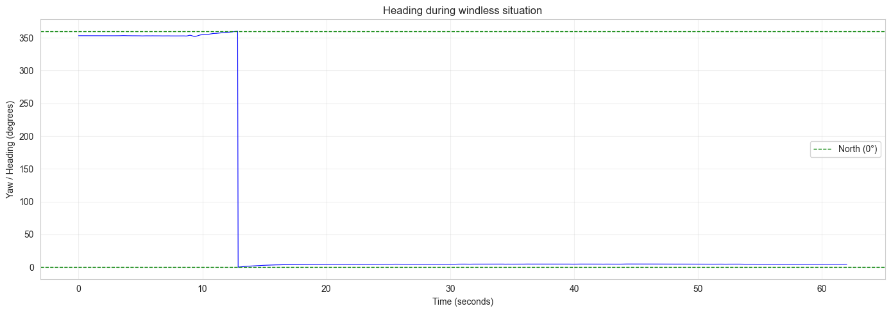
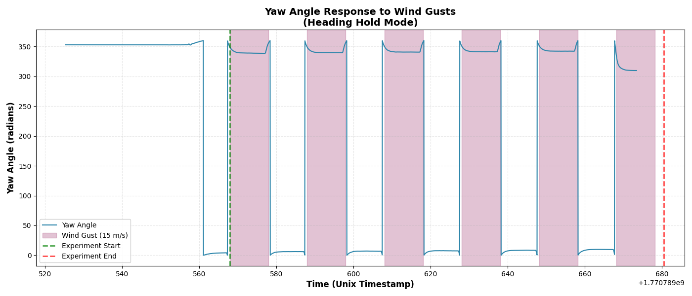
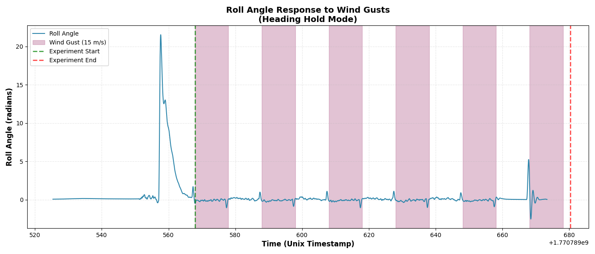
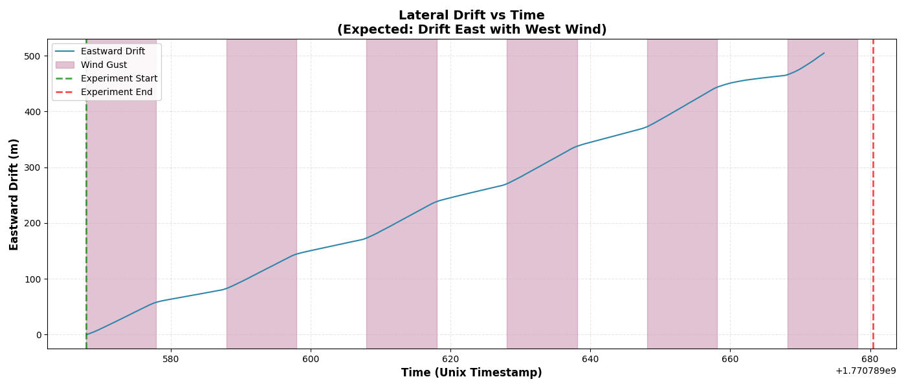

# Windy experiments in Ardupilot SITL while holding heading steady

## Summary

- In a *fixed-wing UAV with a vertical stabilizer*, windy conditions lead to detectable physical response from the UAV, independent of the flight controller. This is known as **weathervaning**.
- We show this by changing the typical `ground course hold` command in the flight controller to `heading hold` command [^1]. 
- This isolates the effect of **weathervaning**, and seperates the UAV's physical response from **crabbing** performed by the flight controller. 

## Background

In order to detect sophisticated GPS spoofing attacks while maintaining low false positives, the flight controller should be able to distinguish between wind and spoofing. Therefore, we must isolate the UAVs physical response to wind before the algorithm makes a determination about the state of the GPS. 

## Strategy

To isolate the effect of wind, we force the UAV to follow a `heading hold` mode. This is different than the UAV's default `ground course hold` mode. Holding the heading means that the UAV's Ardupilot must:

- Detect any change in UAV's pre-set attitude. 
- Act to reverse the change in required attitude
- Block all attempts to get back to true course. 

In our experiment, we accomplish this by frequently instructing the UAV to maintain zero roll, yaw and a constant pitch rate. Our mission settings remain the same:

- The flight path is set to a straight North 0 degrees course. 
- Thurst is set to $60%$.  
- Wind blows at 15 m/s, from west to east, in 10 seconds interval, lasting 10 seconds during each cycle. 

## Discussion

- Here's is the time vs. yaw plot of a flight without wind gusts:

And here's the plot for our experiment: 

Notice that, at the end of each gust period, the UAV rudders back to it's original heading. This is in response to the command to maintain constant yaw rate.

- Here's the roll plot:

Roll angle seems unchanged during the gust on/off period. This is because of the command setting where I instruct the UAV to maintain zero roll. The pattern of the oscillation: a positive roll indicates the right wing is down, and a negative roll indicates that the left wing is down. My hypothesis is that when the wind gust first hits the vertical stabilizer, the wing right tilts a little, showing up as a small positive roll on the gyroscope. As the wind continues, the UAV controller forces the wings to be level (again, because of the command setting), showing up as the zero roll angle. By the end of the wind, the command control overshoots in the absence of the wind and tilts left, showing up as negative roll. 

- Here is the lateral drift experienced by the UAV:

[^1]: These are not existing commands on the SITL interface. Ground course hold is the default response of the Ardupilot `auto` flight mode with fixed mission. To simulate `heading hold` I manually force the SITL to maintain zero roll, yaw and constant pitch rates.